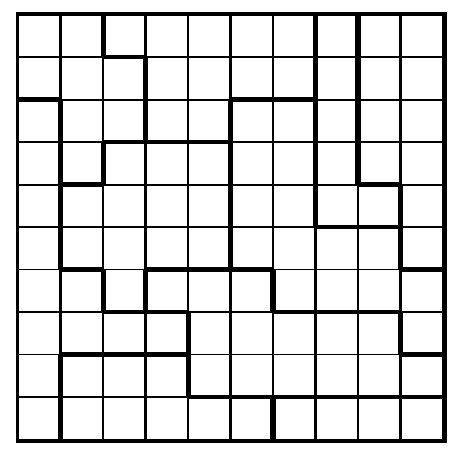
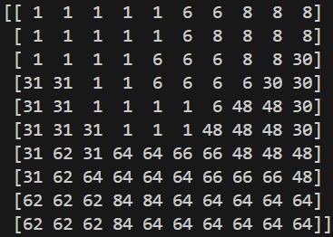
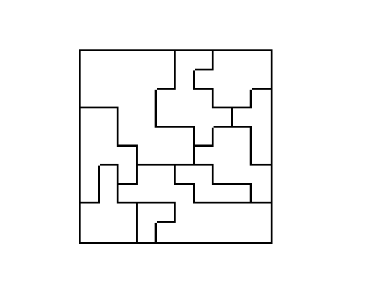

## Star Battles Overview

In this exercise you will be creating a Python program that creates, solves, validates, and displays a Star Battles puzzle.

This is an example of a Star Battles grid.

A Star Battles puzzle consists of a 10 by 10 grid with 10 regions of varying sizes.

The goal for this project is to place 2 stars per row, 2 stars per column, and 2 stars per region. A region is an area enclosed by the bolded lines. 

## Image vs Grid Data Representation
For this project there are 2 major sections: the image processing and the Star Battles algorithm and data representation. In order to effectivley solve this project you should write code to solve Star Battles before touching the image processing. Once you can solve Star Battles, read in a Star Battles image and convert it into the internal data that your functions need. Then recreate the an image with the solution. 

## Star Battles Data Representation
During this project you will need to be able to store where the different regions are. You will be using a 10 by 10 NumPy array as your main data structure. The values in the array will be integers where different integers represent a different region.

Integers of all the same value are part of the same region, so there should be 2 stars in each of these regions.

## Creating a valid grid
This section will detail how you will write code to generate a solvable Star Battle puzzles.

### Overview
There are 2 ways to generate valid grids. Choose 20 points for the stars at random and create regions around the stars or create regions and validate that the grid is solvable.

We will be detailing the first option.

1. In order to solve this you will need to generate a random set of 20 stars such that there are exactly 2 stars in every row and 2 stars.
    * it is possible that there will not be a valid spot for the final star, if this occurs you should restart from step 1
2. You will need to combine 10 pairs of stars into 10 regions. 
    * Create pairs of stars by minimizing total distance use a `stable mariage algorithm`
    * Connect each pair of stars by creating a valid path from one star to the other and mark the path so other paths between stars will not cross
        * a region can not go across a diagonal, so the path should not either
    * If there is no way to connect 2 stars, restart at step 1
3. Expand the regions to cover the entire grid

## Solving the puzzle
In order to solve the puzzle, we will use a branch and bound algorithm.  
There are over `10^157` possible combination to place 20 stars on a 10 by 10 grid.  
However, using branch pruning to be clever and only look for spots that match can reduce it to `10^16`, which is still way too high to solve in the general case, but there is no easy way to work around this.

We will want to choose 2 positions on the first row then go to the next row and choose 2 and so on.  
We only want to consider spots that are valid (2 per row, 2 per column, 2 per region). If a spot would invalidate these requirements, you should skip that position.  
When we reach a row where we can not add 2 stars, we will want to backtrack and try another possiblity. The backtracking will propagate upwards as we rule out possibilites.

This is not the best solution as some cases it will not solve in any reasonable amount of time. The number of backtracking steps ranges from 20 to the 10,000,000+ depending on the grid.

`The test cases have been generated that they SHOULD finish in a resonable amount of time (a few seconds)`

## Image Processing
You will also need to read in images and create your own image with a star placed on each spot of the solution.

The main idea is to create a 10 by 10 grid that represents the the different regions. 

The different numbers correspond to different regions.

For simplicity, your puzzles will not have lines between squares unless there is a region divide.

### Reading in a Puzzle
* The placement of each puzzle varies in each image (more or less white space on the edges), so you will need to detect where the puzzle is 
* The size of the squares and thickness of the lines can vary (all the images were generated with the same code, but there are inconsistencies when reading in the files)
* You should create a 10 by 10 grid with the values corresponding to what region that spot belongs to so you can pass it into your puzzle solver from above

### Displaying a Puzzle
* You will need to output an image with the same grid
* You will need to place stars on the spots your solution finds