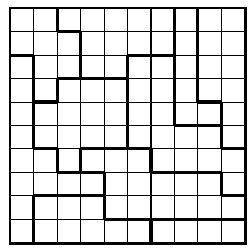

## Star Battles Overview

In this exercise you will be creating a Python program that creates, solves, validates, and displays a Star Battle puzzle.

This is an example of a Star Battle grid.

A Star Battle puzzle consists of a 10 by 10 grid with 10 regions of varying sizes.

The goal is to place 2 stars per row, 2 stars per column, and 2 stars per region. A region is an area enclosed by the bolded lines. 

## Creating a valid grid
This section will detail how you will write code to generate a solvable Star Battle puzzle.

### Overview
There are 2 ways to generate valid grids. Choose 20 points for the stars at random and create regions around the stars or create regions and validate that the grid is solvable.

We will be detailing the first option.

1. In order to solve this you will need to generate a random set of 20 stars such that there are exactly 2 stars in every row and 2 stars.
2. You will need to combine 10 pairs of stars into 10 regions. 
    * Create pairs of stars by minimizing total distance `stable mariage algorithm`
    * Connect each pair of stars by creating a valid path from one star to the other 
        * a region can not go across a diagonal, so the path should not either
    * If there is no way to connect 2 stars, restart at step 1
3. Expand the regions to cover the entire grid

## Solving the puzzle
In order to solve the puzzle, we will use a modified brute force search.
In theory we could use a regular brute force search where we try every possible combination of 20 stars and see if it is a valid position. However, there are `10^157` possible combinations.

Therefore, we are going to significantly reduce the number of possibilites by going row by row.  
We will want to choose 2 positions on a row then go to the next row and choose 2 and so on. When we reach a row where we can not add 2 stars, we will want to backtrack and try another possiblity. The backtracking will propagate upwards as we rule out possibilites.

This is not the best solution as some cases it will not solve in any reasonable amount of time. The number of backtracking steps ranges from 20 to the 10,000,000+ depending on the grid.

`Some cases your code will not find a solution because it will not stop running`