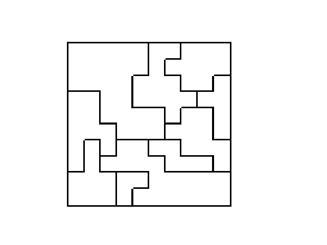

## Star Battles Overview

In this exercise you will be creating a Python program that creates, solves, validates, and displays a Star Battle puzzle.

This is an example of a Star Battle grid.

A Star Battle puzzle consists of a 10 by 10 grid with 10 regions of varying sizes.

The goal is to place 2 stars per row, 2 stars per column, and 2 stars per region. A region is an area enclosed by the bolded lines. 

## Creating a valid grid
This section will detail how you will write code to generate a solvable Star Battle puzzle.

### Overview
There are 2 ways to generate valid grids. Choose 20 points for the stars at random and create regions around the stars or create regions and validate that the grid is solvable.

We will be detailing the first option.

1. In order to solve this you will need to generate a random set of 20 stars such that there are exactly 2 stars in every row and 2 stars.
    * it is possible that there will not be a valid spot for the final star, if this occurs you should restart from step 1
2. You will need to combine 10 pairs of stars into 10 regions. 
    * Create pairs of stars by minimizing total distance use a `stable mariage algorithm`
    * Connect each pair of stars by creating a valid path from one star to the other and mark the path so other paths between stars will not cross
        * a region can not go across a diagonal, so the path should not either
    * If there is no way to connect 2 stars, restart at step 1
3. Expand the regions to cover the entire grid

## Solving the puzzle
In order to solve the puzzle, we will use a modified brute force search.
There are over `10^157` possible combination. However, restricting the brute force search to be clever and only look for spots that match can reduce it to `10^16`, which is still way too high, but there is no easy way to work around this.

We will want to choose 2 positions on the first row then go to the next row and choose 2 and so on. When we reach a row where we can not add 2 stars, we will want to backtrack and try another possiblity. The backtracking will propagate upwards as we rule out possibilites.

This is not the best solution as some cases it will not solve in any reasonable amount of time. The number of backtracking steps ranges from 20 to the 10,000,000+ depending on the grid.

`Some cases your code will not find a solution because it will not stop running`

## Image Processing
You will also need to read in images and create your own image with a star placed on each spot of the solution.

The main idea is to create a 10 by 10 grid that represents the the different regions. 

The different numbers correspond to different regions.

For simplicity, your puzzles will not have lines between squares unless there is a region divide.

### Reading in a Puzzle
* The placement of each puzzle varies in each image, so you will need to detect where the puzzle is. 
* The size of the squares and thickness of the lines can vary
* You should create a 10 by 10 grid as shown above so you can pass it into your puzzle solver from above

### Displaying a Puzzle
* You will need to output an image with the same grid
* You will need to place stars on the spots your solution finds