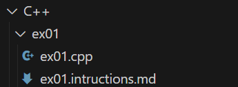
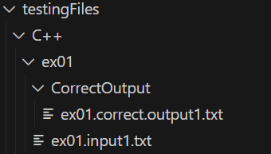
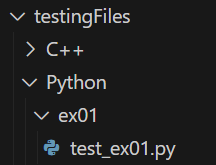

# Overview
To create an exercise that is automatically tested with GitHub actions, you will need to
>Create an instruction file  
Create a starter file  

  
>Create C++ test cases  
Create input and output redirection  
Place in the specific exercise folder in `testingFiles/C++`

>Create Python test cases
Create a Python file and create a function starting with the word `test`  
Place in the specific exercise folder in `testingFiles/Python`

# Exercise Creation Guide
In order to create an exercise there are 4 major parts. Your exercise should follow the naming convention `ex` followed by the next number (example: `ex01`).  
For these instructions we will call the exercise name `ex??`, and you should chnage the `??` to your specific exercise number.

## Instruction Creation
Create a new folder in either the C++ or Python exercise folder.   
Create an instruction file called `ex??.instructions.md`  
Create a C++ or Python file called `ex??.cpp` or `ex??.py` and fill in any needed starter code.

## Test Case Creation
Create a new folder `ex??` in either the C++ or Python testing folder.

### C++ Test Cases
C++ testing utilizes file redirection for input and output. Therefore, correct output files should be prepared in advance. C++ exercises execute via a main function, processing data derived from the input files.

### Python Test Cases
Python tests are established using the PyTest framework. The verification process involves ensuring the output from specific functions is accurate through the use of `assert` commands.

## GitHub Workflow File for Autograding
The example GitHub Workflows are in the `SetUp` folder.

To set up the automated grading on GitHub, copy the autograder configuration exapmle file starting at and including the line `ex??` after the `jobs:` line.  
Place the new exercise autograder in the `cpp.yml` or `python.yml` file in the `.github/workflows` folder.  

You will need to replace all the `??` marks with your specific exercise number (exercise 1 would be `ex01`)  

If your C++ exercise requires more or less test cases than the example number of test cases, add or remove run commands.  

To add new run commands replace the `*`s with the input number in the run command below. Put the run command in the `cpp.yml` along with the previous steps.
>run: |  
>&nbsp;&nbsp;&nbsp;&nbsp;&nbsp;./C++/ex??/ex??.exe < testingFiles/C++/ex??/ex??.input*.txt > \${{ runner.temp }}/ex??.output*.txt  
>&nbsp;&nbsp;&nbsp;&nbsp;&nbsp;diff \${{ runner.temp }}/ex??.output*.txt testingFiles/C++/ex??/CorrectOutput/ex??.correct.output*.txt

